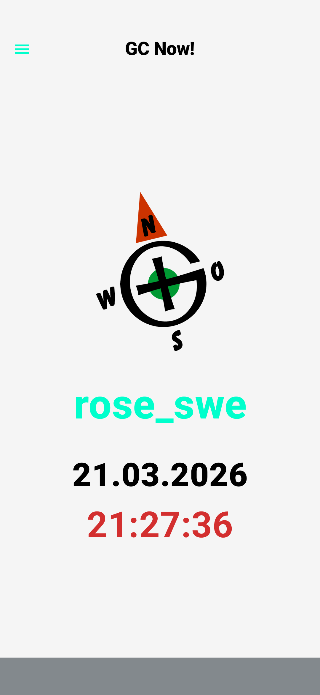
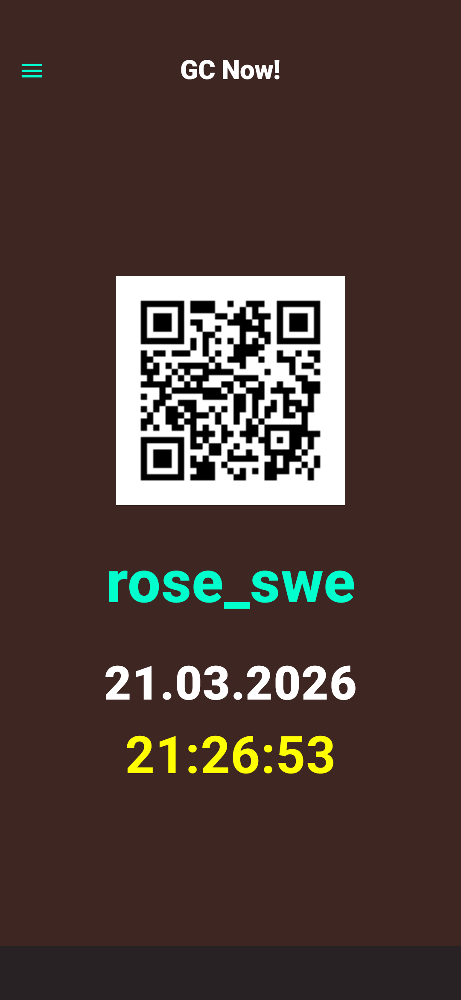

<!-- // @(#) $Id: README.md,v 1.7 2026/03/28 18:46:59 ralph Exp $ -->

# GC-Now App!

>[!NOTE]
English description follows, Kurzübersicht in Deutsch weiter unten

## GC Now! – Read Me – Geocache Helper App

The idea behind **GC Now!** came from a practical need: to create an app that displays the current date and time together with your Geocaching nickname — and, if desired, also shows your personal geocache QR code, profile picture, or logo. The main inspiration was **Virtual Caches**, where a proof photo is often required showing your GC nickname together with the date and the cache. Since I often had two smartphones with me on spontaneous trips, but rarely paper and pen, the app became my solution: with **GC Now!**, I have everything I need right at hand.

**GC Now!** is a fast and flexible app for Android 12 and later. With its clean, high-contrast design and extensive customization options, it offers the ideal solution for anyone who wants to display real-time data in an attractive and personalized way on a mobile device. In addition to an easy switch between light and dark mode, you can customize every detail in **GC Now!** to your liking: personalize your Geocaching nickname, upload your own image, and choose the background color freely — so the app is not only functional, but also truly *yours*. The app requires no additional permissions and does not transmit any data.

## GC Now! – Lies mich – Geocache-Helfer-App

Die Idee hinter **GC Now!** entstand aus einem praktischen Bedürfnis: Eine App zu schaffen, die das aktuelle Datum und die Uhrzeit zusammen mit deinem Geocaching-Nickname anzeigt – und auf Wunsch zusätzlich deinen persönlichen Geocache-QR-Code, dein Profilbild oder dein Logo einblendet. Inspiration waren insbesondere **Virtuelle Caches**, bei denen oft ein Beweisfoto verlangt wird, auf dem dein GC-Nickname zusammen mit Datum und Cache erkennbar ist. Da ich bei spontanen Touren häufig zwei Smartphones, aber selten Papier und Stift dabeihabe, wurde die App zu meiner Lösung: Mit **GC Now!** habe ich alles Notwendige direkt griffbereit.

**GC Now!** ist eine schnelle und flexible App für Android 12 und höher. Mit ihrem klaren, kontrastreichen Design und umfangreichen Anpassungsmöglichkeiten bietet sie die ideale Lösung für alle, die Echtzeitdaten ansprechend und individuell auf ihrem mobilen Gerät darstellen möchten. Neben einem einfachen Wechsel zwischen Hell- und Dunkelmodus kannst du in **GC Now!** jedes Detail nach deinen Wünschen gestalten: deinen Geocaching-Nicknamen personalisieren, ein eigenes Bild hochladen und die Hintergrundfarbe frei festlegen – damit die App nicht nur funktional, sondern auch ganz *deins* ist. Die App benötigt keine zusätzlichen Berechtigungen und überträgt keine Daten.

## App Screen Examples

 

***

## 🛠 Development Environment

* **IDE:** Android Studio Ladybug | 2024.2.1 (or latest Meerkat/Koala version), also tested with 2025.1.3 (Narwhal)
* **Language:** Kotlin 2.x
* **UI Framework:** Jetpack Compose with Material 3
* **Build System:** Gradle (Kotlin DSL)
* **Target SDK:** Android 15 (API 35) / Android 16 (Preview)
* **Min SDK:** Android 12 (API 31)

## 🌟 Key Features & Technical Details

### 1. Adaptive & Responsive Layout

The UI utilizes a dynamic configuration check to switch layouts on the fly.

* **Portrait Mode:** A centered vertical stack (`Column`) optimized for one-handed use.
* **Landscape Mode (90°):** A side-by-side arrangement (`Row`) where the profile image shifts to the left and text data to the right, maximizing the wide aspect ratio of modern mobile displays.

### 2. Intelligent Text Scaling (Anti-Overflow)

To prevent UI breakage with long usernames, the app implements a custom font-scaling algorithm:

* **Default:** 52.sp (up to 10 characters).
* **Medium:** 36.sp (11–15 characters).
* **Small:** 28.sp (15+ characters).
This ensures the brand name remains on a single line regardless of length.

### 3. Real-Time Engine

The dashboard features a live digital clock (HH:mm:ss) driven by a `LaunchedEffect` coroutine. It polls the system time every 1,000ms, ensuring minimal battery impact while maintaining precision.

### 4. Advanced Persistence & Permissions

Unlike standard image pickers, **GC Now!** requests **Persistable URI Permissions**. This allows the app to retain access to user-selected gallery images even after a full device reboot without requiring a permanent "All Files Access" permission.

* **Data Storage:** All user preferences (Theme, Text, Background Color, Image Path) are saved using `SharedPreferences` with KTX extensions for clean, asynchronous writing.

### 5. Custom Theming Engine

* **Dual-Tone Support:** A manual toggle for Dark and Light modes.
* **12-Color Palette:** A curated selection of background colors specifically chosen to provide optimal contrast for both white and black transparent PNG assets.
* **High Contrast:** Neon Turquoise (`#00FFCC`) and Bright Yellow accents for maximum legibility.

## 📦 Dependencies

Add the following to your `app/build.gradle.kts` file:

```kotlin
dependencies {
    // Material Design 3 and Extended Icons
    implementation("androidx.compose.material:material-icons-extended")

    // Image Loading with Coil (SVG & PNG support)
    implementation("io.coil-kt:coil-compose:2.5.0")

    // Android KTX for cleaner SharedPreferences and URI handling
    implementation("androidx.core:core-ktx:1.12.0")
}

```

## 🏗 Build Instructions

### Debug Build

For rapid testing on a physical device:

1. Navigate to `Build > Build Bundle(s) / APK(s) > Build APK(s)`.
2. Locate the file in `app/build/outputs/apk/debug/app-debug.apk`.

### Release Build

For production:

1. Use `Build > Generate Signed Bundle / APK`.
2. Select `APK` and use your `.jks` keystore.
3. Choose the `release` build variant and enable `V2 (Full APK Signature)`.

## 📁 Repository Structure

[Github Repository of GCNow](https://github.com/roseswe/GCNow)

* `MainActivity.kt`: Contains the Core UI logic, State Management, and Permission Handling.
* `AndroidManifest.xml`: Configured for `Edge-to-Edge` display and URI persistence.
* `res/drawable/`: Contains the default `user_image.png` (Fallback asset).


### 📄 License & Credits

**Initial Build Date:** 30.01.2026

**Developed by:** ROSE_SWE, Ralph Roth

**(C) 2000-2026 by ROSE_SWE, Ralph Roth. All rights reserved.**

