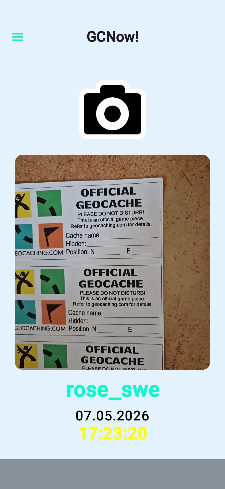
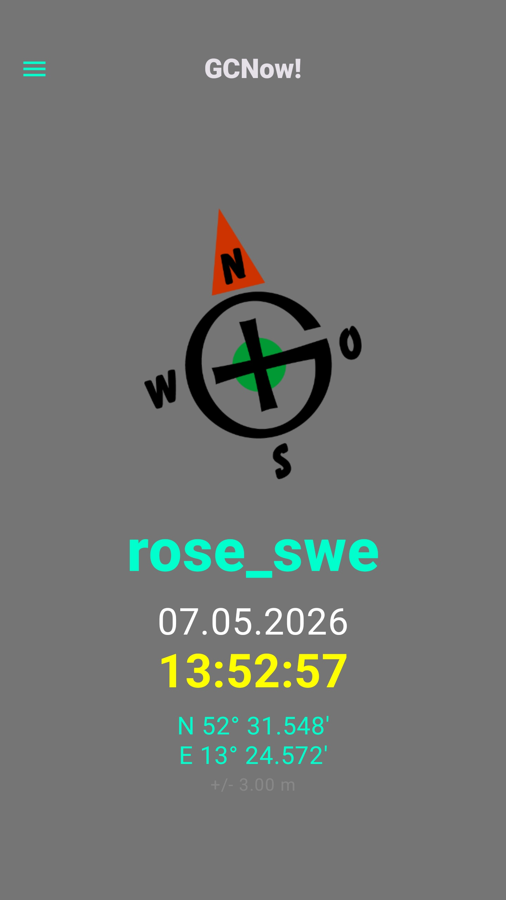

<!-- // @(#) $Id: README.md,v 2.4 2026/05/05 08:32:57 ralph Exp $ -->

# GC-Now App

> [!NOTE]
> English description follows, Kurzübersicht in Deutsch weiter unten

## GC Now! – Your Smart Geocaching Companion

**GC Now!** was born out of a simple idea: an app that shows your current date,
time, and geocaching nickname at a glance—optionally enhanced with your
personal geocache QR code, profile picture, or custom logo.

The inspiration came mainly from **virtual caches**, where a proof photo is
often required showing your nickname, the date, and the cache. On spontaneous
trips, I usually have my smartphone with me—but rarely pen and paper. **GC
Now!** solves exactly that problem: everything you need, ready to go, right in
your pocket.

The app is fast, flexible, and optimized for **Android 12 and above**. A clean,
high-contrast design meets extensive customization options. You can easily
switch between light and dark mode, personalize your geocaching nickname,
upload your own images, and freely choose colors—making **GC Now!** not only
practical but truly yours. Your privacy is fully respected: the app requires no
additional permissions and does not transmit any data.

For use out in the field, **GC Now!** includes practical features: For
**traditional and virtual caches**, you can display GPS coordinates via a
slider and instantly create a screenshot.  For **mystery or multi-caches**, you
can simply hide the coordinates and instead use the built-in live camera with
screenshot functionality — perfect for quickly capturing a clear and reliable
“log proof.”


## Installing the APK on Android

1. **Download the APK**
   Download the desired APK file directly from the
   [GCNow Releases](https://github.com/roseswe/GCNow/releases) page — either on
   your Android device or via PC, then transfer it to your device.

2. **Prepare for Installation**
   Open your device’s _Settings_, go to _Security_ or _Apps & Notifications_, and
   enable installation from _Unknown Sources_ for your browser or file manager.

3. **Install the APK**
   Open the downloaded file from your Downloads folder or file manager and follow
   the on-screen prompts to complete the installation.

4. **Launch the App**
   After successful installation, you’ll find the app in your app drawer
   or on the home screen, ready to use.

> [!NOTE]
> Note: Since the app is not installed via the Play Store, you will need to
> manually update it.

---

## GC Now! – Dein smarter Geocache-Begleiter

**GC Now!** entstand aus einem ganz einfachen Bedürfnis: einer App, die dir auf
einen Blick Datum, Uhrzeit und deinen Geocaching-Nickname anzeigt – ergänzt auf
Wunsch durch deinen persönlichen Geocache-QR-Code, dein Profilbild oder dein
eigenes Logo.

Die Idee dahinter kam vor allem durch **virtuelle Caches**, bei denen häufig
ein Beweisfoto erforderlich ist, auf dem Nickname, Datum und Cache erkennbar
sind. Gerade bei spontanen Touren habe ich zwar fast immer mein Smartphone
dabei – aber selten Papier und Stift. **GC Now!** wurde genau dafür entwickelt:
alles Wichtige direkt zur Hand, jederzeit einsatzbereit.

Die App ist schnell, flexibel und für **Android 12 und höher** optimiert. Ein
klares, kontrastreiches Design trifft auf umfangreiche Anpassungsmöglichkeiten.
Du kannst mühelos zwischen Hell- und Dunkelmodus wechseln, deinen
Geocaching-Nickname individuell gestalten, eigene Bilder einbinden und Farben
frei wählen – so wird **GC Now!** nicht nur praktisch, sondern auch ganz
persönlich. Dabei bleibt deine Privatsphäre gewahrt: Die App benötigt keine
zusätzlichen Berechtigungen und überträgt keinerlei Daten.

Für den Einsatz im Gelände bietet **GC Now!** praktische Zusatzfunktionen: Bei
**Tradis und virtuellen Caches** kannst du per Schieberegler die
GPS-Koordinaten einblenden und direkt einen Screenshot erstellen.  Bei
**Mystery- oder Multi-Caches** blendest du die Koordinaten einfach aus und
nutzt stattdessen die integrierte Live-Kamera mit Screenshot-Funktion – ideal,
um schnell und unkompliziert einen aussagekräftigen „Logproof“ festzuhalten.


## Installation der APK auf Android

1. **APK herunterladen**
   Lade die gewünschte APK-Datei direkt von den
   [GCNow Releases](https://github.com/roseswe/GCNow/releases) herunter — entweder
   über dein Android-Gerät oder per PC mit anschließender Übertragung.

2. **Installation vorbereiten**
   Öffne die _Einstellungen_ deines Geräts, gehe zu _Sicherheit_ oder
   _Apps & Benachrichtigungen_ und aktiviere die Installation aus
   _Unbekannten Quellen_ für deinen Browser oder Dateimanager.

3. **APK installieren**
   Öffne die heruntergeladene Datei im Download-Ordner oder Dateimanager und
   bestätige die Installation mit den angezeigten Schritten.

4. **App starten**
   Nach erfolgreicher Installation findest du die App im App-Menü oder auf dem
   Startbildschirm und kannst sie direkt nutzen.

.

> [!NOTE]
> Hinweis: Da die App nicht über den Play Store installiert wird, musst du Updates manuell durchführen.

---

## App Screen Examples




---

## 🛠 Development Environment

- **IDE:** Android Studio Ladybug | 2024.2.1 (or latest Meerkat/Koala version), also tested with 2025.1.3 (Narwhal)
- **Language:** Kotlin 2.x
- **UI Framework:** Jetpack Compose with Material 3
- **Build System:** Gradle (Kotlin DSL)
- **Target SDK:** Android 15 (API 35) / Android 16 (Preview)
- **Min SDK:** Android 12 (API 31)

## 🌟 Key Features & Technical Details

### 1. Adaptive & Responsive Layout

The UI uses a dynamic configuration check to switch layouts on the fly.

- **Portrait Mode:** Centered vertical stack (`Column`).
- **Landscape Mode:** Side-by-side arrangement (`Row`) where logo/camera shifts
  left and text data to the right.

- **Portrait Mode:** A centered vertical stack (`Column`) optimized for one-handed use.
- **Landscape Mode (90°):** A side-by-side arrangement (`Row`) where the profile
  image shifts to the left and text data to the right, maximizing the wide aspect ratio of modern mobile displays.
- **Dynamic Scaling:** When active, the camera takes up ~1/3 of the screen.
- **Intelligent Resizing:** Logos and text automatically scale down to 70% to
  prevent UI overflow when the camera is enabled.

### 2. Intelligent Text Scaling (Anti-Overflow)

- **Shutter Sound:** Uses `MediaActionSound` for a realistic camera click.
- **Clean Capture:** The UI briefly hides the capture button during the process
  to ensure a clean screenshot.
- **Capture Compatibility:** Uses `ImplementationMode.COMPATIBLE` to ensure the
  live camera feed is visible in saved images.

Custom font-scaling for nicknames: 52.sp (<10 chars), 36.sp (11-15 chars),
or 28.sp (15+ chars).

- **Default:** 52.sp (up to 10 characters).
- **Medium:** 36.sp (11–15 characters).
- **Small:** 28.sp (15+ characters).

This keeps the brand name on a single line regardless of length.

### 3. Real-Time Engine

The dashboard features a live digital clock (HH:mm:ss) driven by a
`LaunchedEffect` coroutine. It polls the system time every 1,000 ms, ensuring
minimal battery impact while maintaining precision.

### 4. Advanced Persistence & Permissions

Unlike standard image pickers, **GC Now!** requests **Persistable URI
Permissions**. This allows the app to retain access to user-selected gallery
images even after a full device reboot without requiring a permanent "All Files
Access" permission.

**Data Storage:** User preferences such as Theme, Text, Background Color, and
Image Path are saved using `SharedPreferences` with KTX extensions for clean,
asynchronous writing.

### 5. Custom Theming Engine

- **Dual-Tone Support:** Manual toggle for Dark and Light modes.
- **12-Color Palette:** A curated selection of background colors chosen to provide optimal contrast for both white and black transparent PNG assets.
- **High Contrast:** Neon Turquoise (`#00FFCC`) and Bright Yellow accents for maximum legibility.

## 🌍 Navigation Features

GCNow! also includes geocaching-focused navigation features for easier field use.

- **WGS84 Standard Formatting:** Coordinates are displayed in the geocaching-friendly degrees and decimal minutes format: `DD° MM.MMM'`.
- **Live Accuracy Meter:** Displays the GPS signal quality in meters (`+/- X m.m`) so users can judge the reliability of the zero point.
- **Dynamic Update Interval:** A customizable **GPS Refresh Slider** (1 to 10 seconds) in the settings menu lets users prioritize either fast tracking or lower battery usage.


## 🛠️ Updated Technical Setup

To support the GPS engine, the following configurations were added:

### **Permissions:**

The app requires precise location access to calculate WGS84 coordinates:

```xml
<uses-permission android:name="android.permission.ACCESS_FINE_LOCATION" />
<uses-permission android:name="android.permission.ACCESS_COARSE_LOCATION" />
<uses-permission android:name="android.permission.CAMERA" />
```

### **16KB Page Alignment (Android 15+):**

To ensure compatibility with 16KB devices, the build uses:

#### **Dependencies:**

The app now uses the Google Play Services Location API for efficient power management:

```kotlin
// build.gradle.kts
dependencies {
    implementation("com.google.android.gms:play-services-location:21.2.0")
}
```

## 🔄 Persistence & Settings

The application now remembers the following additional user preferences:

- **GPS Visibility:** Whether the GPS display was active.
- **Interval Frequency:** The preferred refresh rate in seconds across app sessions.

## 📦 Dependencies

Add the following to your `app/build.gradle.kts` file:

```kotlin
dependencies {
    // Material Design 3 and Extended Icons
    implementation("androidx.compose.material:material-icons-extended")

    // Image Loading with Coil (SVG & PNG support)
    implementation("io.coil-kt:coil-compose:2.5.0")

    // Android KTX for cleaner SharedPreferences and URI handling
    implementation("androidx.core:core-ktx:1.12.0")

    // Google Play Services Location
    implementation("com.google.android.gms:play-services-location:21.2.0")
}
```

## 🏗 Build Instructions

### Debug Build

For rapid testing on a physical device:

1. Navigate to `Build > Build Bundle(s) / APK(s) > Build APK(s)`.
2. Locate the file in `app/build/outputs/apk/debug/app-debug.apk`.

### Release Build

For production:

1. Use `Build > Generate Signed Bundle / APK`.
2. Select `APK` and use your `.jks` keystore.
3. Choose the `release` build variant and enable `V2 (Full APK Signature)`.

## 📁 Repository Structure

[Github Repository of GCNow](https://github.com/roseswe/GCNow)

- `MainActivity.kt`: Contains the core UI logic, state management, permission handling, and GPS display logic.
- `AndroidManifest.xml`: Configured for `Edge-to-Edge` display, URI persistence, and location permissions.
- `res/drawable/`: Contains the default `user_image.png` fallback asset.

## Testbed

- /e/-OS 3.7s - A12
- Fairphone - A15
- Samsung Galaxy - A16

## 📄 License & Credits

**Initial Build Date:** 30.01.2026

**Current Version:** 2.4.1

**CVS/SVN Info:** `$Id: README.md,v 2.4 2026/05/05 08:32:57 ralph Exp $`

**(C) 2000-2026 by ROSE_SWE, Ralph Roth. All rights reserved.**
